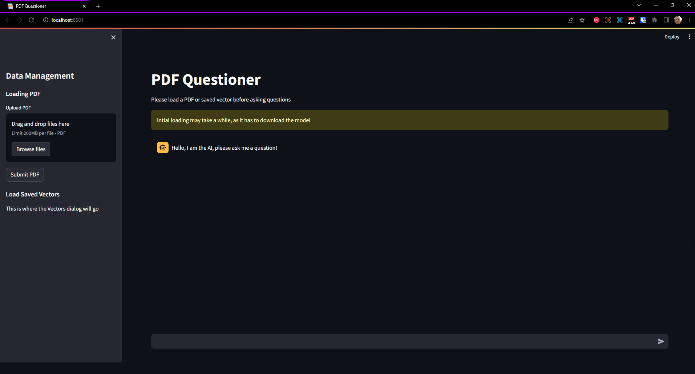
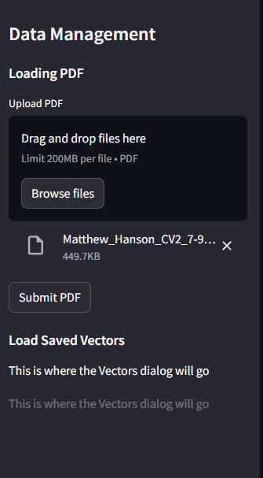
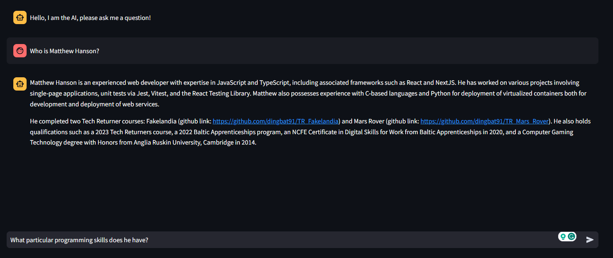

# DINGPDF

## Details

Hey everyone, this is my learning attempt to create a functional tool for asking questions against an input pdf via a LLM Locally rather than relying on chatGPT or other cloud based solutions.

The UI is created using [streamlit](https://streamlit.io/) and the LLM is operated from processed using [Langchain](https://www.langchain.com/) and FAISS for vector database storage. the model used is hardcoded currently as the [Mistral-7B-OpenOrca](https://huggingface.co/Open-Orca/Mistral-7B-OpenOrca) model from huggingface.

## Usage

To begin create a virtual environment and install the requirements.txt file. Then run the following command to begin the application:

```powershell
streamlit run app.py
```

This will open a browser, that after loading (and if needed, downloading) the model will display the following information:



using the sidebar on the left import a pdf (you can import multiple but your mileage may vary on success of processing) after that hit the "submit PDF" button



After the spinner has finished you can begin interacting with the model by typing into the main chat windows.



Debug information can be found in the console window that the streamlit app is running in.

## TBD

- Storing processed vectors and loading them in for later reuse
- optimisation work

## limitations

So the program is currently not hugely optimised in any way. There is an initial loading period that can be long as it downloads the LLM, and any pdf input needs to be fairly clean. It also runs the LLM locally so while you won't need an API key, it's ability to function is limited by your local machine.

It also primarily uses the CPU rather than the GPU, I believe this can be solved by changing to a different version of pytorch but I have yet to attempt implementing or testing that.
